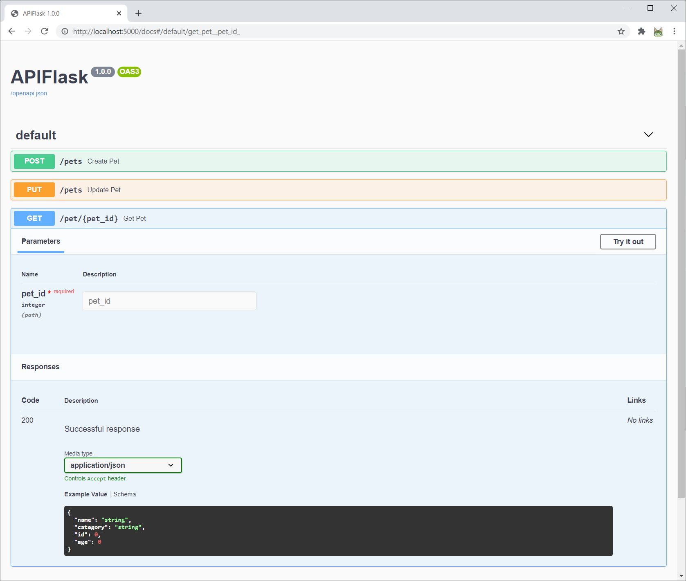
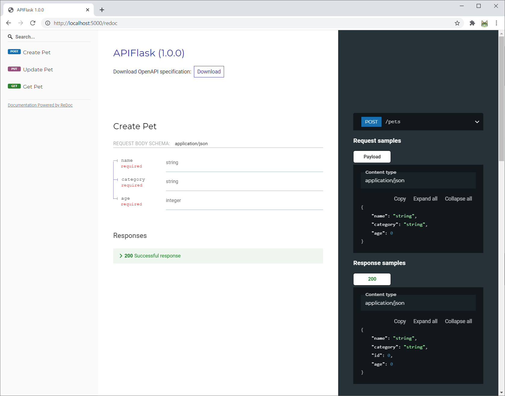

# APIFlask

[](https://github.com/greyli/apiflask/actions)

A lightweight Python 3.7+ Web API framework, based on Flask, marshmallow-code projects and other Flask extensions.

**Currently this project is in plan/experimental stage, break changes are expected. Improvements and suggestions are welcome!

## Installation

```bash
$ pip install apiflask
```

## Example

```python
from apiflask import APIFlask
from apiflask.decorators import args, body, resp
from marshmallow import Schema

app = APIFlask(__name__)


class PetSchema(Schema):
    id = Integer(dump_only=True)
    name = String(required=True)
    age = Integer(required=True)
    category = String(required=True)


@app.get('/pets/<int:pet_id>')
@resp(PetSchema)
def get_pet(pet_id):
    pass


@app.post('/pets')
@body(PetSchema)
@resp(PetSchema)
def create_pet(pet):
    pass


@app.put('/pets/<int:pet_id>')
@body(PetSchema)
@resp(PetSchema)
def update_pet(pet_id, updated_pet):
    pass
```

Save the file as `app.py`, then run it with:

```bash
$ flask run
``` 

Now visit the interactive docs by Swagger UI at <http://localhost:5000/docs>:



Or you can visit the alternative Redoc docs at <http://localhost:5000/redoc>:



The auto-generated OpenAPI spec file are available at <http://localhost:5000/openapi.json>.


## Links

- Documentation (WIP)
- [PyPI](https://pypi.python.org/pypi/APIFlask)
- [Change Log](https://github.com/greyli/apiflask/blob/master/CHANGES.md)

---

APIFlask starts as a fork of [APIFairy 0.6.3dev](https://github.com/miguelgrinberg/APIFairy) and inspired by [FastAPI](https://github.com/tiangolo/fastapi).
