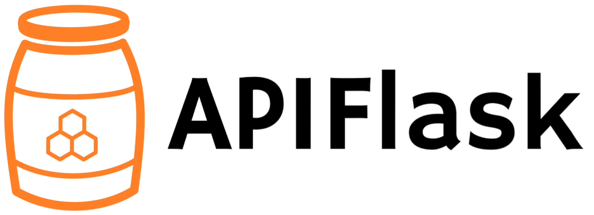

# APIFlask

[](https://github.com/greyli/apiflask/actions)

A lightweight Web API framework based on Flask and marshmallow-code projects.

With APIFlask, you will have:

- More sugars for view function (`@app.get()`, `@app.post()`, `app.put()`, `app.delete()`, `@input()`, `@output()`, `@doc()`, etc.)
- Automatic request validation and serialization (with Webargs)
- Automatic response validation and deserialization (with Marshmallow)
- Automatic OpenAPI Specification (OAS, formerly Swagger Specification) document generation (with APISpec)
- Automatic API documentation with Swagger UI and Redoc
- API Authorization support (with Flask-HTTPAuth)
- Automatic JSON response for HTTP errors

*Currently this project is in active development stage, bugs and break changes are expected. Welcome to leave any suggestions or feedbacks in [this issue](https://github.com/greyli/apiflask/issues/1) or just submit a pull request.*

## Requirements

- Python 3.7+ 
- Flask 1.1.0+

## Installation

For Linux and macOS:

```bash
$ pip3 install apiflask
```

For Windows:

```bash
> pip install apiflask
```

## Example

```python
from apiflask import APIFlask, input, output, Schema
from apiflask.fields import Integer, String

app = APIFlask(__name__, title='Wonderful API', version='1.0')


class PetQuery(Schema):
    query = String(required=True)


class PetIn(Schema):
    name = String(required=True)
    age = Integer(required=True)
    category = String(required=True)


class PetOut(Schema):
    id = Integer(required=True)
    name = String(required=True)
    age = Integer(required=True)
    category = String(required=True)


@app.get('/pets/<int:pet_id>')
@output(PetOut)
def get_pet(pet_id):
    pass


@app.post('/pets')
@input(PetQuery, location='query')
@input(PetIn)
@output(PetOut)
def create_pet(query, pet):
    pass


@app.put('/pets/<int:pet_id>')
@input(PetIn)
@output(PetOut)
def update_pet(pet_id, updated_pet):
    pass


@app.delete('/pets/<int:pet_id>')
def delete_pet(pet_id):
    pass
```

Save the file as `app.py`, then run it with:

```bash
$ flask run
```

Now visit the interactive API documentation by Swagger UI at <http://localhost:5000/docs>:


Or you can visit the alternative Redoc documentation at <http://localhost:5000/redoc>:


The auto-generated OpenAPI spec file are available at <http://localhost:5000/openapi.json>.

For a more complete example, see [/examples](https://github.com/greyli/apiflask/tree/master/examples).

## Links

- Website: https://apiflask.com
- Documentation: https://apiflask.com/docs
- PyPI Releases: https://pypi.python.org/pypi/APIFlask
- Change Log: https://apiflask.com/changelog
- Source Code: https://github.com/greyli/apiflask
- Issue Tracker: https://github.com/greyli/apiflask/issues
- Discussion: https://github.com/greyli/apiflask/discussions
- Twitter: https://twitter.com/apiflask

## Dependencies

- [Flask](https://github.com/pallets/flask)
- [Marshmallow](https://github.com/marshmallow-code/marshmallow)
- [Webargs](https://github.com/marshmallow-code/webargs)
- [APISpec](https://github.com/marshmallow-code/apispec)
- [Flask-Marshmallow](https://github.com/marshmallow-code/flask-marshmallow)
- [Flask-HTTPAuth](https://github.com/migulgrinberg/flask-httpauth)

## Relationship with Flask

APIFlask is a thin wrapper on top of Flask, which means it's 100% compatible with the Flask ecosystem. You only need to remember two differences:

- When creating an application instance, use `APIFlask` instead of `Flask`.
- When creating a blueprint instance, use `APIBlueprint` instead of `Blueprint`.

For the minimal Flask application:

```python
from flask import Flask, request, escape

app = Flask(__name__)

@app.route('/')
def hello():
    name = request.args.get('name', 'Human')
    return f'Hello, {escape(name)}'
```

now change to APIFlask will like this:

```python
from apiflask import APIFlask  # step one
from flask import request, escape

app = APIFlask(__name__)  # step two

@app.route('/')
def hello():
    name = request.args.get('name', 'Human')
    return f'Hello, {escape(name)}'
```

In a word, to make Web API development in Flask more easily, APIFlask provided `APIFlask` and `APIBlueprint` to extend Flask's `Flask` and `Blueprint` objects, it also shipped with some helpful utilities. Other than that, you are still using Flask.

---

APIFlask starts as a fork of [APIFairy](https://github.com/miguelgrinberg/APIFairy) and inspired by [FastAPI](https://github.com/tiangolo/fastapi).
