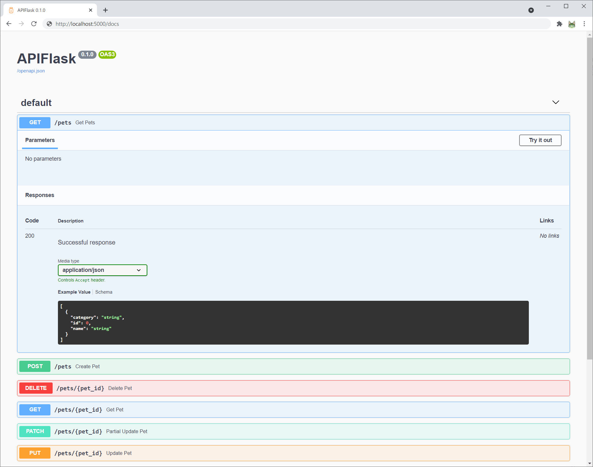
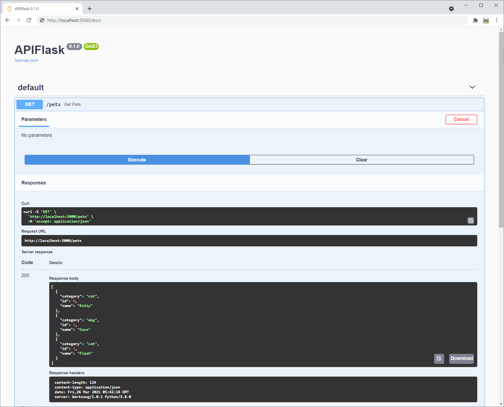

# Examples

There is only one simple example application for now, follow the commands in the *Installation* section to run it on your computer.

## Installation

For macOS and Linux:

```
$ git clone https://github.com/greyli/apiflask
$ cd apiflask/examples
$ python3 -m venv venv
$ source venv/bin/activate
$ pip3 install apiflask
$ flask run
  * Running on http://127.0.0.1:5000/ (Press CTRL+C to quit)
```

For Windows:

```
> git clone https://github.com/greyli/apiflask
> cd apiflask\examples
> python -m venv venv
> venv\Scripts\activate
> pip install apiflask
> flask run
  * Running on http://127.0.0.1:5000/ (Press CTRL+C to quit)
```

## Try it out

When the application is running, now you can visit the interactive API documentation at http://localhost:5000/docs. Inside the detail tab of each endpoints, you can click the "Try it out" button to test the APIs:



Then click the "Execute" button, it will send a request to the related endpoint and retrieve the response back:



## Do some experiment

If you want to do some experiment on the example application, just open the `app.py` with your favorite editor. To make the application reload every time after you change the code, use the `--reload` option for `flask run`:

```
$ flask run --reload
```

Furthermore, you can run the application in debug mode, it will enable the reloader and debugger as default. To enable debug mode, you will need to set the environment variable `FLASK_ENV` to `development` before execute `flask run`, see [Debug Mode](https://flask.palletsprojects.com/en/master/quickstart/#debug-mode) for more details.

## More examples

There will be more advanced examples to be added here, if you have made your own, you can just submit a pull request to add the source link here.
