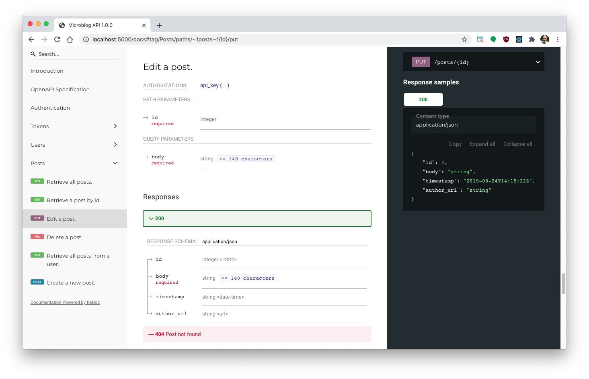

.. APIFairy documentation master file, created by
   sphinx-quickstart on Sun Sep 27 17:34:58 2020.
   You can adapt this file completely to your liking, but it should at least
   contain the root `toctree` directive.

Overview
========

APIFairy is a minimalistic API framework for Flask with the following goals:

- Give you a way to specify what the input arguments for each endpoint are,
  and automatically validate them for you.
- Give you a way to specify what the response format for each endpoint is, and
  automatically serialize these responses for you.
- Automatically generate API documentation for your project.
- Introduce the least amount of rules. You should be able to code your
  endpoints in the style that you like.

Below you can see an example API endpoint augmented with
APIFairy decorators::

    from apifairy import authenticate, body, response

    # ...

    @posts_blueprint.route('/posts/<int:id>', methods=['PUT'])
    @authenticate(token_auth)
    @body(update_post_schema)
    @response(post_schema)
    @other_responses({404: 'Post not found'})
    def put(updated_post, id):
        """Edit a post."""
        post = Post.query.get_or_404(id)
        for attr, value in updated_post.items():
            setattr(post, attr, value)
        db.session.commit()
        return post

APIFairy's decorators are simple wrappers for existing solutions. In the
example above, ``token_auth`` is an intialized authentication object from the
Flask-HTTPAuth extension, and ``post_schema`` and ``update_post_schema`` are
Flask-Marshmallow schema objects. These wrappers allow Flask-APIFairy to
automatically generate documentation using the OpenAPI 3.x standard. Below is a
screenshot of the documentation for the above endpoint:

Installation
============

APIFairy is installed with ``pip``::

    pip install apifairy

